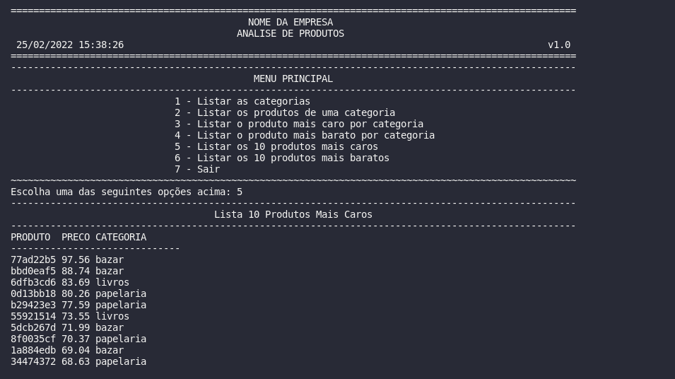

## Programa Desenvolve 40+ Magalu / Let's Code
### Python: (revisão de conteúdo)
#### Lógica de programação
#### Programação Orientada a Objetos 

## Análise de produtos

#### Utilização dos conceitos:
 - variáveis
 - estruturas de controle
 - estruturas compostas
 - classe
 - objetos
 - atributos
 - métodos

